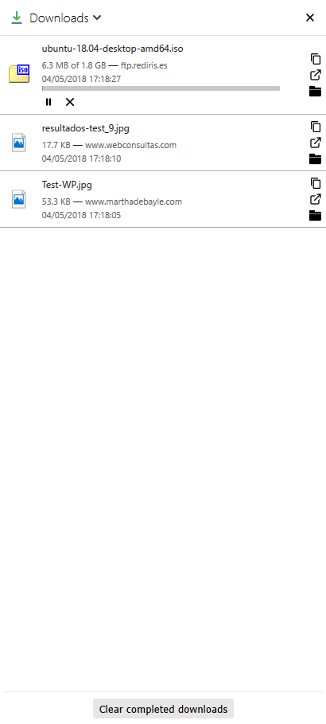

# Downloads sidebar web extension

This extension will display a list of your latest downloads in the Firefox sidebar.

The latest version is **0.5**

## How do I use this?

Open your Firefox sidebar and choose "Downloads" from the top drop-down list.

Keyboard shortcut is **F4**.

There is also a browser toolbar button which opens the Downloads sidebar.

Features:

* pause, resume, cancel, retry, erase download
* copy download link
* open download page link
* show downloaded item in folder
* erase all recent downloads that are not active (active = downloading or paused)

Screenshot:

Credits:

* uses Ractive.js (https://github.com/ractivejs/ractive)
* folder, play and pause icons by ionicons (http://ionicons.com)
* downloads icon by Danilo Demarco (http://www.danilodemarco.com)
* retry icon by Artyom Khamitov (https://www.iconfinder.com/Kh.Artyom)
* cancel icon by Anastasya Bolshakova (https://www.iconfinder.com/nastu_bol)
* external link icon by Cole Bemis (https://www.iconfinder.com/colebemis)
* copy icon by Google (http://google.com/design/)
