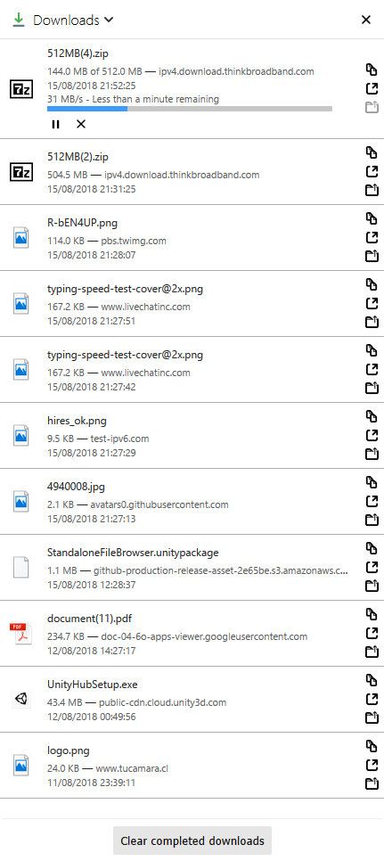

# Downloads sidebar web extension

This extension will display a list of your latest downloads in the Firefox sidebar.

The latest version is **0.6**

## How do I use this?

Open your Firefox sidebar and choose "Downloads" from the top drop-down list.

Keyboard shortcut is **F4**.

There is also a browser toolbar button which opens the Downloads sidebar.

### Features

* pause, resume, cancel, retry, erase download
* copy download link
* open download page link
* show downloaded item in folder
* erase all recent downloads that are not active (active = downloading or paused)

### Screenshot

### Credits

* uses Ractive.js (https://github.com/ractivejs/ractive)
* downloads icon by Pixel perfect on flaticon (https://www.flaticon.com/authors/pixel-perfect)
* play and pause icons by ionicons (http://ionicons.com)
* cancel, copy, open external, folder, pause, play and retry icon from firefox (https://design.firefox.com/icons/viewer/)

### Requested features

* dark theme
* download speed indicator

### Features that are not possible to implement

As of 2018/04/14 it's not possible to implement the following features, because the API is intentionally limiting them or offers no replacement:

* auto-opening panel after downloading is done
* auto-opening file after downloading is done
* drag and droping using the official sidebar API doesn't seem possible